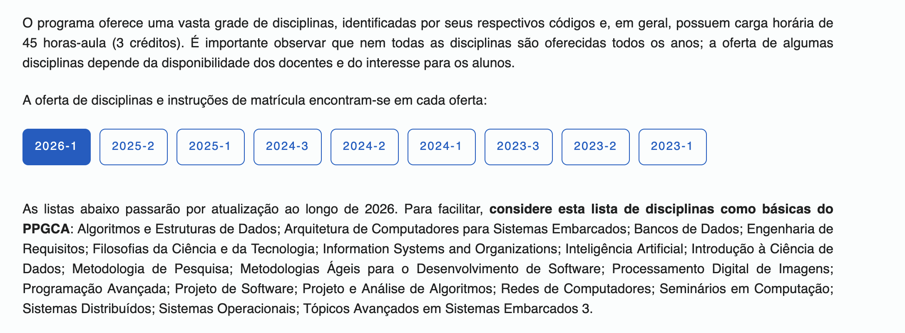

Vale a pena fazer uma pós-graduação? Eu também fiquei nessa dúvida --- e nesse artigo vou compartilhar o que aprendi com minha experiência, falando sobre programas **lato** e **stricto sensu**, as vantagens de cada um, e o que eu faria diferente se estivesse começando hoje.

## Diferenças entre lato e stricto sensu

**Lato sensu** significa "em sentido amplo" e compreende programas de especialização voltados ao mercado de trabalho. É o caminho dos MBAs e especializações clássicas.

**Stricto sensu** significa "em sentido estrito" e compreende programas de mestrado e doutorado, voltados à pesquisa acadêmica. Na média, são 2 anos para mestrado e 4 anos para doutorado.

É importante lembrar que existem mestrados profissionais e mestrados acadêmicos --- e a diferença entre eles é significativa. O primeiro enfatiza estudos e técnicas voltados ao alto nível de qualificação profissional, enquanto o segundo é voltado à pesquisa acadêmica.

Os alunos que cursam o mestrado podem dar sequência aos estudos no doutorado, quando têm por objetivo a docência ou a pesquisa.

E sim, quem tem um MBA também pode fazer um doutorado.

## Qual faz mais sentido para Tech People?

Depende.

Se o objetivo é se aprofundar em um assunto específico, o **stricto sensu** é a melhor opção. Você pode escolher um programa de mestrado ou doutorado focado em uma área do seu interesse --- e isso abre portas tanto na academia quanto em posições de pesquisa avançada no setor privado.

Já se o objetivo for ficar mais competitivo no mercado rapidamente, o **lato sensu** faz mais sentido. Um bom MBA ou especialização te dá bagagem prática, networking e um certificado que o mercado reconhece --- sem precisar se trancar por anos em uma universidade.

A questão central não é "qual é o melhor?", mas sim "qual é o melhor **para você, agora**?"

## Como entrar em uma pós-graduação?

Relativamente fácil, mas depende do tipo de programa:

1.  Já ter colado grau

2.  Possuir diploma de curso de graduação (reconhecido pelo MEC)

Entrar no **lato sensu** é mais simples. Normalmente, basta preencher um formulário, pagar a taxa de inscrição e enviar os documentos necessários.

Agora, finalizar o curso com um bom aproveitamento depende 90% do seu comprometimento.

## Como entrar em um mestrado ou doutorado?

O processo é mais complexo. Normalmente, envolve:

1.  Enviar um projeto de pesquisa

2.  Passar por um edital

Ou seja: você precisa ter uma ideia clara do que quer pesquisar --- e isso pode ser um desafio para quem está começando.

### Lista de coisas que eu faria diferente se estivesse começando hoje

#### Encontraria uma área de interesse

Esse é o passo mais elemental. Sem uma área de interesse, é difícil se envolver em um projeto de pesquisa ou mesmo escolher um programa de pós-graduação.

#### Procuraria uma faculdade com um programa na minha área de interesse

Nem tudo é sobre o nome da instituição. O mais importante é encontrar um programa que tenha pesquisadores com os quais você possa trabalhar. Isso pode incluir deslocamento --- talvez se mudar de cidade --- ou se adaptar ao transporte público.

#### Entraria em contato com os professores

Depois de encontrar um programa que me interessasse, eu entraria em contato com os professores para entender melhor o que eles pesquisam, quais são as linhas de pesquisa do programa, e se eles estão aceitando novos alunos.

[Lista de professores e linhas de pesquisa do programa de mestrado em Ciência da Computação da UTFPR (Campo Mourão)](https://www.utfpr.edu.br/cursos/programas-de-pos-graduacao/ppgcc-cm/area-academica/docentes#linha-de-pesquisa-inteligencia-computacional-e-sistemas-distribuidos)

O primeiro contato seria por email, se apresentando e demonstrando interesse no programa de mestrado. Se o professor responder, excelente! Se não, não se desespere --- nem todo professor tem tempo para responder a emails de potenciais alunos.

### Conclusão

**Stricto sensu** para quem quer se aprofundar. **Lato sensu** para quem quer se diferenciar rápido. A escolha depende de onde você está e para onde quer ir.

O processo de entrar em um programa de pós-graduação é relativamente fácil --- mas finalizar com um bom aproveitamento depende do seu comprometimento.
