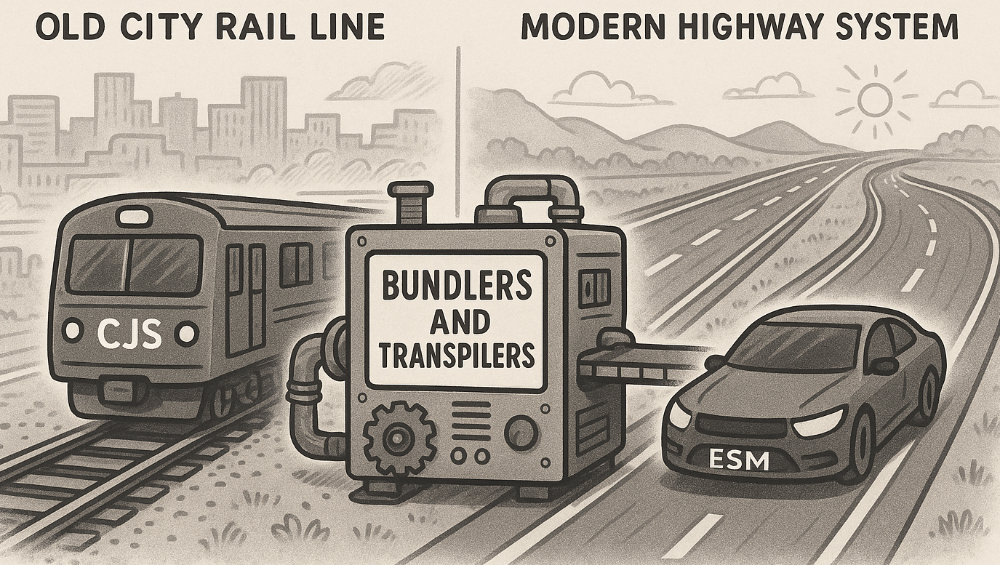

import { LinkCard } from "@astrojs/starlight/components";

You've been there: opening a JavaScript project and seeing a mix of `require()` statements and `import` declarations.

```js
const module1 = require("something1");
import module2 from "something2";
```

It's confusing. Why does JavaScript—a language famous for its flexibility—have two competing, _incompatible_ (kinda) ways to handle modules?



<LinkCard title="See also" href="/webdev/bundling-x-transpiling/" />

The answer lies deep in the history of JavaScript, tracing its roots from a simple browser scripting language to a powerhouse running servers and beyond. The existence of **CommonJS (CJS)** and **ES Modules (ESM)**, along with the subsequent rise of powerful tools like bundlers and transpilers, explains why building modern JS is rarely just running a single file.

Here is why there are multiple ways of building and structuring JavaScript.

---

## Part 1: JavaScript's Roots and the Rise of CommonJS

In the early 2000s, JavaScript was restricted primarily to the browser, and critically, it **did not have a native module system**. Code sharing meant dumping a collection of `<script>` tags onto an HTML page.

The game changed with the arrival of **Node.js**, which aimed to run JavaScript on the server. Running on a server required a way to organize code into reusable pieces. This need led to the creation of **CommonJS (CJS)**, which utilizes the `require()` function for importing and `module.exports` for exporting.

The CJS Drawback: Synchronicity

While CJS worked extremely well for Node.js, it has a major technical distinction: CJS is **synchronous**. When you call `require()`, the module is loaded and processed immediately upon execution. This design works perfectly on a server environment where files are accessed locally on a disk.

However, this synchronous nature created problems in the browser, which needs to load resources **asynchronously** over a network.

## Part 2: The Standardization of ES Modules (ESM)

As JavaScript continued to evolve, the language eventually gained its own native, standardized module system: **ES Modules (ESM)**.

ESM uses the familiar `import` and `export` syntax. Critically, ESM is **asynchronous** and native to the JavaScript language. This asynchronous nature allows for critical modern optimizations, such as **tree-shaking**, which removes unused code from the final output, minimizing file size.

The catch? **Browsers only began to understand the native** **import** **syntax after 2017**.

## Part 3: The Workarounds: Bundling and Transpiling

Because JavaScript developers wanted to use modern syntax (ESM, TypeScript, new language features) long before environments (browsers, older Node versions) natively supported them, a complex layer of build tooling became essential.

These build processes generally rely on two core concepts: transpiling and bundling.

### 1. Transpiling

**Transpiling** is the process of converting modern language syntax (like TypeScript or ES6+) into a version of JavaScript that older or specific runtimes can understand. For example, a tool like **Babel** was vital because it allowed developers to write modern JavaScript (including `import` statements) and convert that code into CJS or other compatible formats, bridging the gap when native support was lacking.

When working in a server context, transpiling converts TypeScript (`.ts`) into JavaScript (`.js`) compatible with the version of Node.js being used.

### 2. Bundling

**Bundling** takes multiple files, transpiles them if needed, and combines them into a single file or a few smaller files. This is often necessary when running code in environments that restrict file access, such as the browser (for optimizing I/O loading time) or serverless functions (like AWS Lambda or edge environments).

Tools like **Browserify** historically allowed developers to write CJS code (using `require()`) and package it into a single file the browser could execute. Today, modern bundlers like esbuild, Webpack, Rollup, and Bun handle this process to ensure minimal code is deployed.

## Part 4: Modern Runtimes and the Future of JS

The complexity of requiring separate tools is gradually fading, primarily due to new JavaScript runtimes that integrate build tooling and module handling natively.

Today, the Node.js environment still supports both systems, but you must define how modules are treated:

• Files with `.cjs` are treated as CommonJS.

• Files with `.mjs` are treated as ESM.

• Setting `"type": "module"` in `package.json` changes the default behavior for `.js` files to be treated as ESM.

New runtimes like **Bun** and **Deno** embrace ESM as the default modern standard.

**Bun**, built on the JavaScriptCore engine, focuses heavily on speed by integrating its own ultra-fast transpiler and bundler, often aiming to replace multiple external tools. Bun's design allows it to execute TypeScript and JSX instantly by transpiling them on the fly.

Furthermore, advanced optimization techniques exist, such as Bun’s **Bytecode Caching**. Bytecode caching is a build-time optimization where the engine pre-compiles your JavaScript into **bytecode** (a lower-level representation that's faster to execute than source code). This moves the expensive work of parsing and compiling from runtime (which happens every time the app starts) to the build step, resulting in dramatically faster startup times, especially for CLI tools and large applications.

## Conclusion

The multiple ways of building JS are a historical artifact of the language's evolution and environments.

**CJS** (`require`) emerged to solve server-side needs but is synchronous and associated with legacy Node.js code. **ESM** (`import`) is the modern, asynchronous standard of the language.

The complexity of bundling and transpiling arose to force these new language standards into older or resource-constrained environments (like browsers and serverless). Today, while the tooling is still necessary for most production deployments, modern runtimes are integrating these steps to make the developer experience faster, ensuring that what was once a "gambiarra linda" (a beautiful workaround) is now a seamless, highly optimized process.

## See also

This blog post is a transcription of a video I made sometime ago:

<iframe
  width="560"
  height="auto"
  src="https://www.youtube.com/embed/pj_Wh6znUI0?si=q1P7PZt15o1UeFLR"
  title="YouTube video player"
  frameborder="0"
  allow="accelerometer; autoplay; clipboard-write; encrypted-media; gyroscope; picture-in-picture; web-share"
  referrerpolicy="strict-origin-when-cross-origin"
  allowfullscreen
></iframe>
